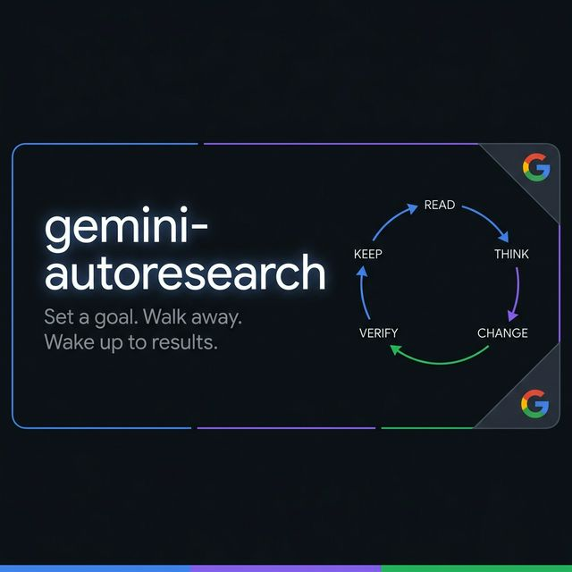

# gemini-autoresearch (Hindi)

<div align="center">

</div>

> Gemini CLI को एक अथक स्वायत्त सुधार इंजन (autonomous improvement engine) में बदलें।
> लक्ष्य निर्धारित करें। काम शुरू करें। परिणामों के साथ जागें।

यह 'Gemini CLI' और 'Antigravity IDE' के लिए एक कौशल (skill) है जो किसी भी मापने योग्य परिणाम वाले कार्य पर स्वायत्त रूप से काम करता है।

---

## यह कैसे काम करता है? (How it works)

1. **लक्ष्य चुनें**: बताएं कि आप क्या सुधारना चाहते हैं।
2. **दायरा (Scope)**: वह फाइलें बताएं जिन्हें बदला जा सकता है।
3. **माप (Metric)**: वह संख्या जिसे आप बेहतर बनाना चाहते हैं।
4. **जांचें (Verify)**: वह कमांड जो परिणाम मापता है।
5. **सुरक्षा (Guard)**: वह कमांड जो यह सुनिश्चित करता है कि कुछ और न टूटे।

---

## इंस्टाल करें (Install)

```bash
git clone https://github.com/supratikpm/gemini-autoresearch.git
cp -r gemini-autoresearch/skills/autoresearch .agents/skills/autoresearch
```

विवरण के लिए मुख्य [README.md](../../README.md) देखें।
